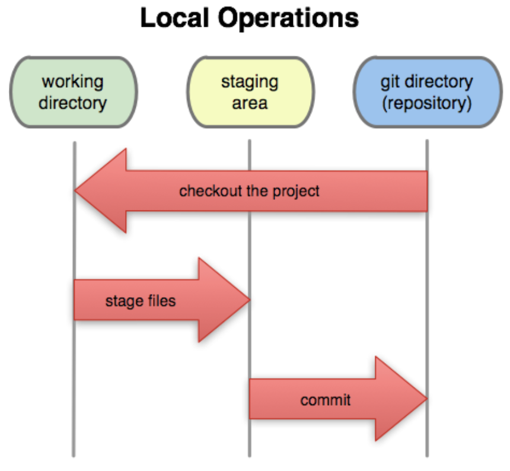

# Collaboration with Git and GitHub

## Assessment
Once you finish the slides, go back and write a short-sentence summarizing below:
- [ ] Understand the difference between Git and GitHub
    * What I know: 
        * **Git** is a version control system that takes snapshots of your code as you work through it. It just tracks the changes and doesn't do anything with it
        * **GitHub** is a popular version control system that allows you to  upload your projects in the cloud and collaborate with other developers
- [ ] Understand the relationship between the working directory, staging area, local repository, and remote repository
    * What I know: sounds like the common workflow
- [ ] Learn the core Git commands
    * What I know: 
        * `git add <url-of-file>` add changes to your repo 
        * `git commit -m "comments"` commit your changes to the repo
        * `git push` or `git push origin <name-of-branch>` will push the repo or update the repo in GitHub
        * `git checkout <name-of-branch>` will create a new branch
        * `git diff` checks what changes are different from the last commit
- [ ] Learn how to collaborate using Git & GitHub
    * What I know: cloning, pulling, merging, markdown or writing in GitHub

## Version Control
* A way to keep track of changes and different versions of your code/documents automatically

## Git vs GitHub
* Git
    * Tracks changes rather than version
* GitHub
    * Cloud based hosting platform for Git repo
    * Allows collaboration on projects

## How Git works
* Git takes snapshots of the project
* When you make a **commit** you are saving the current state of your project/code

## Git workspaces
* **working directory** the file or directory that you are working on
    * example: on your laptop, you have a projects folder containing the files you are working on

<cite></cite> by <a href="https://softwareengineering.stackexchange.com/users/2439/rook">Rook</a> 

* **staging area** the state of your files when you made a change but have not commited them yet
* **local Git repository** the file you are working on your local machine that is initialized for git version control
* **remote Git repository** a version controlled file that is elsewhere (like GitHub)  

## Git workflow
* **unmodified** You haven't mande a change since the last commit
* **modified** A change took place, but before you entered the command `git add` 
* **staged** `git add` command was entered
* **commited** `git commit` command was entered and the version is saved locally

## Git Cheat Sheet
